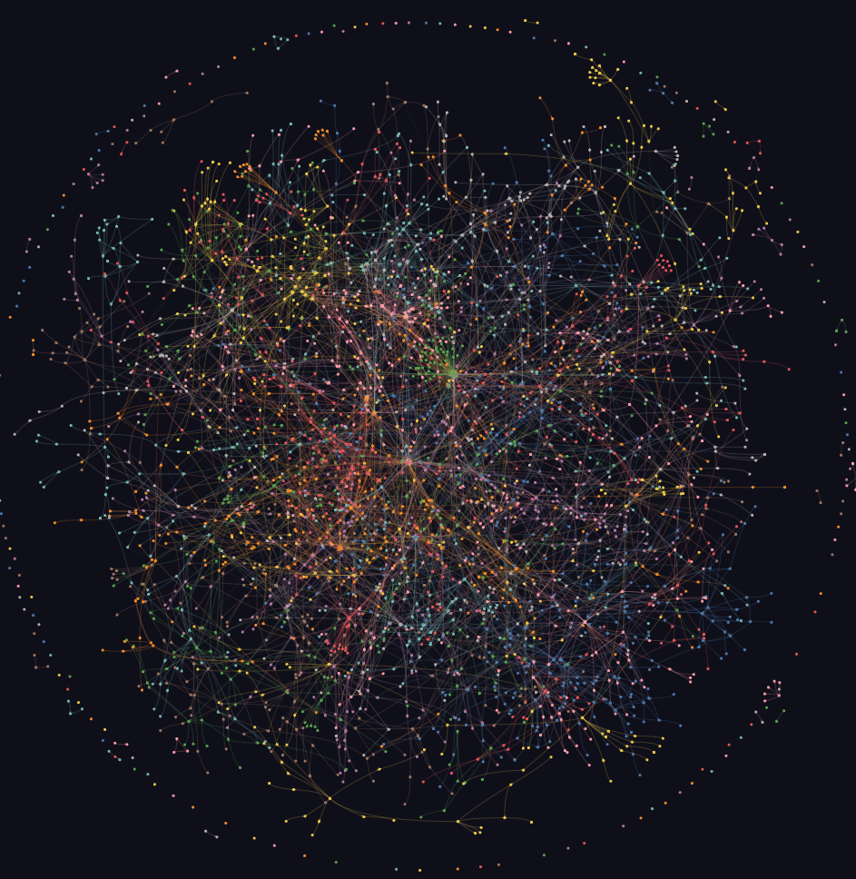

# Ai-GraphX



<p align="center">
  <a href="../../README.md"></a>
</p>

**Ai-GraphX** — инструмент для построения графа знаний, который превращает весь ваш проект — код, документацию, статьи, изображения и видео — в навигационную графовую структуру, которую можно запрашивать вместо поиска по файлам.

## Что такое Ai-GraphX?

Ai-GraphX анализирует файлы вашего проекта и строит граф знаний, показывая:
- **Сущности и концепции** — функции, классы, переменные, темы, идеи
- **Связи** — как вещи соединяются (импорты, вызовы, цитаты, ссылки)
- **Сообщества** — кластеры связанных файлов и концепций
- **Междокументные связи** — ссылки между кодом, документами и статьями, о которых вы бы никогда не подумали спросить

Вместо того чтобы искать по сотням файлов через grep, вы задаёте вопросы, и Ai-GraphX проходит по графу, чтобы найти ответы.

## Зачем использовать Ai-GraphX?

**Для новых кодовых баз:**
- Увидеть архитектуру, прежде чем что-то менять
- Понять, как модули соединяются
- Найти точки входа и ключевые компоненты

**Для исследовательских проектов:**
- Построить граф цитирования из статей
- Связать концепции между несколькими документами
- Отследить, как идеи развиваются через корпус

**Для текущей разработки:**
- Отслеживать, что изменилось между коммитами
- Видеть "горячие" файлы (наиболее часто изменяемые)
- Понимать влияние изменений по всему проекту

**Три вещи, которые Ai-GraphX делает, а поиск по файлам — нет:**
1. **Постоянный граф** — связи сохраняются между сессиями. Задавайте вопросы через недели без повторного чтения всего.
2. **Честный след аудита** — каждое ребро помечено как `EXTRACTED` (извлечено), `INFERRED` (выведено) или `AMBIGUOUS` (неоднозначно). Вы знаете, что было найдено, а что — предположено.
3. **Междокументные сюрпризы** — детекция сообществ находит связи между концепциями в разных файлах, о которых вы бы никогда не подумали спросить напрямую.

---

Введите `/graphx` в вашем AI-ассистенте по написанию кода, и он отобразит весь проект — код, документы, PDF, изображения, видео — в граф знаний, который можно запрашивать вместо поиска по файлам.

Работает в Claude Code, Devin, Cursor, Gemini CLI, GitHub Copilot CLI, VS Code Copilot Chat, Aider, OpenClaw, Factory Droid, Trae, Hermes, Kiro, Pi и Google Antigravity.

```
/graphx .
```

Всё. Вы получаете три файла:

```
graphx-out/
├── graph.html       откройте в любом браузере — кликайте узлы, фильтруйте, ищите
├── GRAPH_REPORT.md  основные моменты: ключевые концепции, неожиданные связи, предлагаемые вопросы
└── graph.json       полный граф — запрашивайте в любое время без повторного чтения файлов
```

---

## Установка

**Требуется Python 3.10+**

```bash
uv tool install ai-graphx && graphx install
# или: pipx install ai-graphx && graphx install
# или: pip install ai-graphx && graphx install
```

> **`graphx: command not found`?** Используйте `uv tool install ai-graphx` или `pipx install ai-graphx` — оба автоматически добавляют CLI в PATH. При обычном `pip` добавьте `~/.local/bin` (Linux) или `~/Library/Python/3.x/bin` (Mac) в PATH, или запустите `python -m graphx`.

### Выберите вашу платформу

| Платформа | Команда установки |
|-----------|-------------------|
| Claude Code (Linux/Mac) | `graphx install` |
| Claude Code (Windows) | `graphx install --platform windows` |
| Codex | `graphx install --platform codex` |
| OpenCode | `graphx install --platform opencode` |
| GitHub Copilot CLI | `graphx install --platform copilot` |
| VS Code Copilot Chat | `graphx vscode install` |
| Aider | `graphx install --platform aider` |
| OpenClaw | `graphx install --platform claw` |
| Factory Droid | `graphx install --platform droid` |
| Trae | `graphx install --platform trae` |
| Trae CN | `graphx install --platform trae-cn` |
| Gemini CLI | `graphx install --platform gemini` |
| Hermes | `graphx install --platform hermes` |
| Kiro IDE/CLI | `graphx kiro install` |
| Pi coding agent | `graphx install --platform pi` |
| Cursor | `graphx cursor install` |
| Google Antigravity | `graphx antigravity install` |

> Пользователи Codex: также добавьте `multi_agent = true` под `[features]` в `~/.codex/config.toml`.
> Codex использует `$graphx` вместо `/graphx`.

---

## Заставьте ассистента всегда использовать граф

Запустите это один раз в вашем проекте после построения графа:

| Платформа | Команда |
|-----------|---------|
| Claude Code | `graphx claude install` |
| Codex | `graphx codex install` |
| OpenCode | `graphx opencode install` |
| GitHub Copilot CLI | `graphx copilot install` |
| VS Code Copilot Chat | `graphx vscode install` |
| Aider | `graphx aider install` |
| OpenClaw | `graphx claw install` |
| Factory Droid | `graphx droid install` |
| Trae | `graphx trae install` |
| Trae CN | `graphx trae-cn install` |
| Cursor | `graphx cursor install` |
| Gemini CLI | `graphx gemini install` |
| Hermes | `graphx hermes install` |
| Kiro IDE/CLI | `graphx kiro install` |
| Pi coding agent | `graphx pi install` |
| Google Antigravity | `graphx antigravity install` |

Это записывает небольшой конфигурационный файл, который сообщает вашему ассистенту читать `GRAPH_REPORT.md` перед ответом на вопросы о кодовой базе. На платформах, поддерживающих хуки (Claude Code, Codex, Gemini CLI), хук срабатывает автоматически перед каждым вызовом чтения файла — ваш ассистент перемещается по графу вместо поиска по всему.

Удалите с помощью соответствующей команды (например, `graphx claude uninstall`).

---

## Что в отчёте

- **Бог-узлы** — наиболее связанные концепции в вашем проекте. Всё проходит через них.
- **Неожиданные связи** — связи между вещами, которые живут в разных файлах или модулях. Ранжированы по неожиданности.
- **"Почему"** — встроенные комментарии (`# NOTE:`, `# WHY:`, `# HACK:`), docstrings и обоснования дизайна из документов извлекаются как отдельные узлы, связанные с кодом, который они объясняют.
- **Предлагаемые вопросы** — 4–5 вопросов, на которые граф уникально способен ответить.
- **Метки уверенности** — каждая выведенная связь помечена как `EXTRACTED`, `INFERRED` или `AMBIGUOUS`. Вы всегда знаете, что было найдено, а что — предположено.

---

## Какие файлы обрабатываются

| Тип | Расширения |
|-----|-----------|
| Код (25 языков) | `.py .ts .js .jsx .tsx .go .rs .java .c .cpp .rb .cs .kt .scala .php .swift .lua .zig .ps1 .ex .exs .m .jl .vue .svelte .sql` |
| Документы | `.md .mdx .html .txt .rst .yaml .yml` |
| Office | `.docx .xlsx` (требуется `pip install ai-graphx[office]`) |
| PDF | `.pdf` |
| Изображения | `.png .jpg .webp .gif` |
| Видео / Аудио | `.mp4 .mov .mp3 .wav` и другие (требуется `pip install ai-graphx[video]`) |
| YouTube / URL | любой URL видео (требуется `pip install ai-graphx[video]`) |

Код извлекается локально без API-вызовов (AST через tree-sitter). Всё остальное проходит через API модели вашего AI-ассистента.

---

## Распространённые команды

```bash
/graphx .                        # построить граф для текущей папки
/graphx ./docs --update          # повторно извлечь только изменённые файлы
/graphx . --cluster-only         # перезапустить кластеризацию без повторного извлечения
/graphx . --no-viz               # пропустить HTML, только отчёт + JSON
/graphx . --wiki                 # построить markdown-вики из графа

/graphx query "what connects auth to the database?"
/graphx path "UserService" "DatabasePool"
/graphx explain "RateLimiter"

/graphx add https://arxiv.org/abs/1706.03762   # получить статью и добавить её
/graphx add <youtube-url>                       # транскрибировать и добавить видео

graphx hook install              # авто-пересборка при git commit
graphx merge-graphs a.json b.json              # объединить два графа
```

См. [полный справочник команд](#полный-справочник-команд) ниже.

---

## Игнорирование файлов

Создайте `.graphxignore` в корне вашего проекта — тот же синтаксис, что и у `.gitignore`, включая отрицание `!`:

```
# .graphxignore
node_modules/
dist/
*.generated.py

# индексировать только src/, игнорировать всё остальное
*
!src/
!src/**
```

---

## Настройка для команды

`graphx-out/` предназначен для коммита в git, чтобы каждый в команде начинал с карты.

**Рекомендуемые дополнения в `.gitignore`:**
```
graphx-out/manifest.json    # основан на mtime, ломается после git clone
graphx-out/cost.json        # только локально
# graphx-out/cache/         # опционально: закоммитьте для скорости, пропустите чтобы уменьшить размер репозитория
```

**Рабочий процесс:**
1. Один человек запускает `/graphx .` и коммитит `graphx-out/`.
2. Все делают pull — их ассистент сразу читает граф.
3. Запустите `graphx hook install` для авто-пересборки после каждого коммита (только AST, без затрат на API).
4. Когда документы или статьи меняются, запустите `/graphx --update` для обновления этих узлов.

---

## Использование графа напрямую

```bash
# запросить граф из терминала
graphx query "show the auth flow"
graphx query "what connects DigestAuth to Response?" --graph graphx-out/graph.json

# предоставить граф как MCP сервер (для повторного доступа через tool-call)
python -m graphx.serve graphx-out/graph.json
```

MCP сервер даёт вашему ассистенту структурированный доступ: `query_graph`, `get_node`, `get_neighbors`, `shortest_path`.

> **Примечание для WSL / Linux:** В Ubuntu установлен `python3`, а не `python`. Используйте venv чтобы избежать конфликтов:
> ```bash
> python3 -m venv .venv && .venv/bin/pip install "ai-graphx[mcp]"
> ```

---

## Конфиденциальность

- **Файлы кода** — обрабатываются локально через tree-sitter. Ничего не покидает вашу машину.
- **Видео / аудио** — транскрибируются локально с faster-whisper. Ничего не покидает вашу машину.
- **Документы, PDF, изображения** — отправляются в API модели вашего AI-ассистента (Anthropic, OpenAI и др.) с использованием вашего собственного API-ключа.
- Никакой телеметрии, никакого отслеживания использования, никакой аналитики.

---

## Полный справочник команд

```
/graphx                          # запустить в текущей директории
/graphx ./raw                    # запустить в конкретной папке
/graphx ./raw --mode deep        # более агрессивное извлечение связей
/graphx ./raw --update           # повторно извлечь только изменённые файлы
/graphx ./raw --directed         # сохранить направление рёбер
/graphx ./raw --cluster-only     # перезапустить кластеризацию на существующем графе
/graphx ./raw --no-viz           # пропустить HTML-визуализацию
/graphx ./raw --obsidian         # сгенерировать Obsidian vault
/graphx ./raw --wiki             # построить markdown-вики для агентов
/graphx ./raw --svg              # экспортировать graph.svg
/graphx ./raw --graphml          # экспорт для Gephi / yEd
/graphx ./raw --neo4j            # сгенерировать cypher.txt для Neo4j
/graphx ./raw --neo4j-push bolt://localhost:7687
/graphx ./raw --watch            # авто-синхронизация при изменении файлов
/graphx ./raw --mcp              # запустить MCP stdio сервер

/graphx add https://arxiv.org/abs/1706.03762
/graphx add <video-url>
/graphx add https://... --author "Name" --contributor "Name"

/graphx query "what connects attention to the optimizer?"
/graphx query "..." --dfs --budget 1500
/graphx path "DigestAuth" "Response"
/graphx explain "SwinTransformer"

graphx hook install              # post-commit + post-checkout хуки
graphx hook uninstall
graphx hook status

graphx claude install / uninstall
graphx codex install / uninstall
graphx opencode install
graphx cursor install / uninstall
graphx gemini install / uninstall
graphx copilot install / uninstall
graphx aider install / uninstall
graphx claw install / uninstall
graphx droid install / uninstall
graphx trae install / uninstall
graphx trae-cn install / uninstall
graphx hermes install / uninstall
graphx kiro install / uninstall
graphx antigravity install / uninstall

graphx clone https://github.com/karpathy/nanoGPT
graphx merge-graphs a.json b.json --out merged.json
graphx watch ./src
graphx check-update ./src
graphx update ./src
graphx cluster-only ./my-project
```

---

## Узнать больше

- [Как это работает](../../docs/how-it-works.md) — конвейер извлечения, детекция сообществ, оценка уверенности, бенчмарки
- [ARCHITECTURE.md](../../ARCHITECTURE.md) — разбивка модулей, как добавить язык
- [Опциональные интеграции](../../docs/docker-mcp-sqlite.md) — Docker MCP Toolkit + SQLite

---

<details>
<summary>Вклад в проект</summary>

**Рабочие примеры** — самый полезный вклад. Запустите `/graphx` на реальном корпусе, сохраните вывод в `worked/{slug}/`, напишите честный `review.md` о том, что граф понял правильно и неправильно, и откройте PR.

**Ошибки извлечения** — откройте issue с входным файлом, записью кэша (`graphx-out/cache/`) и тем, что было пропущено или неправильно.

См. [ARCHITECTURE.md](../../ARCHITECTURE.md) для описания ответственности модулей и как добавить язык.

</details>
